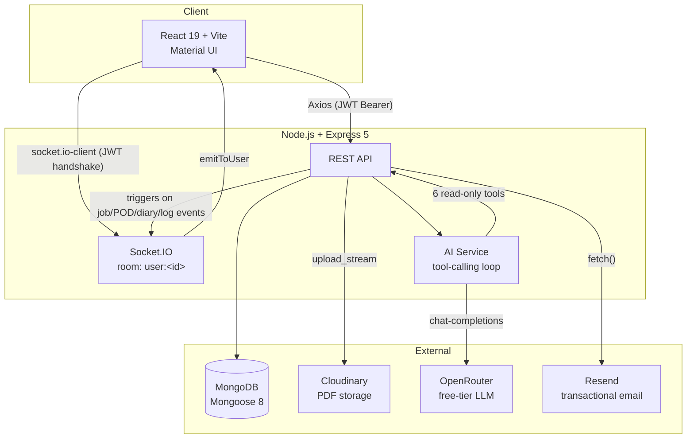

# XFlyve — Interview Handbook

Every fact below was checked directly against the code on `main` during this write-up — test counts were produced by actually running the suites, not recalled. Nothing here was carried over from an older version of this app or an older report.

**How to use this:** each question follows the same structure — Interview Answer (what you'd say out loud), Technical Explanation (the mechanism), Main Code (the actual snippet), Files (where to look), Why I Chose This Approach (the tradeoff), Follow-up Questions (with honest short answers), Limitations (what's genuinely not solved).

---

## Q1 — How does authentication work end-to-end?

**Interview Answer:** "Login checks email and password against the driver collection, then issues a JWT with a 7-day expiry containing the user's ID and role. Every subsequent request sends that token as a Bearer header, and the backend verifies the signature *and* re-checks the account's active status against the database on every single request — so deactivating someone takes effect immediately even though their token is still valid for days."

**Technical Explanation:** `authController.login` calls `bcrypt.compare`, checks `recordStatus`/`active`, then signs `{ id, role }` with `JWT_SECRET`. `authMiddleware.js` exports `verifyAuthToken`, shared by both the REST middleware and the Socket.IO handshake, so there's exactly one place JWT verification logic lives.

**Main Code:**
```js
// authMiddleware.js
const verifyAuthToken = async (token) => {
  const decoded = jwt.verify(token, process.env.JWT_SECRET);
  const userId = decoded.id || decoded._id || decoded.sub;
  const account = await Driver.findById(userId).select("recordStatus active");
  const active = Boolean(account) && account.recordStatus === "active" && account.active !== false;
  return { user: { ...decoded, id: userId, _id: userId }, active };
};
```

**Files:** `backend/controllers/authController.js`, `backend/middlewares/authMiddleware.js`, `backend/sockets/socketServer.js` (reuses the same function).

**Why I Chose This Approach:** The obvious alternative is a short-lived access token plus a revocable refresh token — genuinely the better design. It was deliberately left out of this pass; the code says so directly: "a stolen token is valid for its full lifetime... Refresh-token rotation... deliberately not built in this security-hardening pass — out of scope alongside MFA/SSO/OAuth/session management." The per-request DB check on account status is what makes a 7-day token tolerable in the meantime.

**Follow-up Questions:**
- *"Why check the database on every request instead of trusting the JWT alone?"* — "Because the JWT itself can't be revoked once issued. Checking `recordStatus`/`active` on every request is the only way to make deactivation actually take effect before the token's natural 7-day expiry."
- *"Where's the token stored on the frontend?"* — "In the client's own storage (not a cookie — this is a pure bearer-token API), sent manually as an `Authorization` header on every Axios call."

**Limitations:** No refresh rotation, no "log out everywhere," no token revocation list. A stolen token works for its full lifetime unless the account is deactivated.

---

## Q2 — How are passwords hashed, and what's the double-hash guard?

**Interview Answer:** "Bcrypt at cost factor 12, and it happens in a Mongoose pre-save hook on the model itself, not in the controller — so every write path gets the same hashing automatically. There's a regex guard that checks whether a password already looks like a bcrypt hash before re-hashing it, which stops an already-hashed value from getting hashed a second time and permanently locking the account."

**Technical Explanation:** The hook only hashes when `isModified("password")` is true *and* the current value doesn't match the bcrypt hash format.

**Main Code:**
```js
// driver.js
const BCRYPT_HASH_REGEX = /^\$2[aby]\$\d{2}\$.{53}$/;
driverSchema.pre("save", async function (next) {
  if (this.isModified("password") && !BCRYPT_HASH_REGEX.test(this.password)) {
    this.password = await bcrypt.hash(this.password, 12);
  }
  next();
});
```

**Files:** `backend/models/driver.js`.

**Why I Chose This Approach:** Hashing in the controller is the obvious alternative, but it means every new write path has to remember to do it. The schema hook makes it structurally impossible to save a raw password by accident. The guard exists because `isModified` alone isn't safe — any code path re-assigning an already-hashed value would otherwise get double-hashed.

**Follow-up Questions:**
- *"Why cost factor 12, not the library default of 10?"* — "12 is a more conservative, commonly-recommended number — deliberately more expensive to brute-force. It's not benchmarked against this app's actual traffic, just a sane default."

**Limitations:** No server-side password complexity requirements beyond "required, non-empty."

---

## Q3 — How does role-based access control work?

**Interview Answer:** "Two roles, admin and driver, stored on the same Driver collection. Route-level middleware — `requireAdmin`, `requireDriver`, `requireDriverOrAdmin` — checks `req.user.role` before the controller ever runs, and returns 403 immediately if it doesn't match."

**Main Code:**
```js
function requireAdmin(req, res, next) {
  if (req.user && req.user.role === "admin") return next();
  return res.status(403).json({ success: false, message: "Access denied: Admins only" });
}
```

**Files:** `backend/middlewares/roleMiddleware.js`, `backend/models/driver.js` (the `role` enum field).

**Why I Chose This Approach:** A single generic `requireRole(...allowed)` middleware is the obvious alternative. Named functions instead is a readability trade — `requireAdmin` at the top of a route file states the rule at a glance. Role checks live in middleware, not controllers, because role is knowable from the JWT alone before touching the database — it's route-level policy, separate from the ownership checks controllers still have to do (see Q4).

**Follow-up Questions:**
- *"What stops someone from editing their JWT's role to 'admin'?"* — "They can edit the payload locally, but they can't produce a valid signature for it without `JWT_SECRET`. `jwt.verify` rejects anything that doesn't match — the role is only trustworthy because the signature is."

**Limitations:** Exactly two roles, no finer permission levels (no "read-only admin," for instance).

---

## Q4 — Why isn't role alone enough — how do ownership checks work?

**Interview Answer:** "Role tells you 'this is some driver,' not 'this driver owns this resource.' So on top of role middleware, controllers that touch a specific document — a POD, a work diary, a job — compare the resource's owner field against the authenticated caller directly, and let admins bypass that comparison."

**Main Code:**
```js
// jobPodController.js — getPOD
const userId = req.user._id || req.user.id;
if (req.user.role !== "admin" && pod.driverId.toString() !== userId.toString()) {
  return res.status(403).json({ success: false, message: "Access denied" });
}
```

**Files:** `backend/controllers/jobPodController.js`, `backend/controllers/workDiaryController.js`, `backend/controllers/workLogController.js`, `backend/controllers/jobController.js` — same pattern repeated in each.

**Why I Chose This Approach:** Without this, `requireDriver` alone would let any driver read any other driver's documents just by guessing an ID — role middleware has no idea whose resource it is. This has to happen per-controller, after the document is fetched, because ownership is a property of the specific record, not the route.

**Follow-up Questions:**
- *"Why not centralize this in middleware too?"* — "Role is knowable before hitting the database; ownership needs the actual document to compare against the caller, so it can only happen after the controller has fetched it. It could live in a shared helper to cut the repetition — it doesn't today, and that's a real gap (see Q5)."

**Limitations:** The pattern is copy-pasted per controller, not a single reusable helper — consistent today, but nothing structurally prevents a new route from getting it wrong or skipping it.

---

## Q5 — Tell me about a real security bug you found and fixed.

**Interview Answer:** "During an audit pass, `GET /api/admin/trucks` turned out to have no admin-role check at all — every *other* route in that same file had `requireAdmin`, just not the list endpoint. Any authenticated driver token could list the entire fleet. I found it by systematically comparing every route in the file against its siblings instead of trusting the file as a whole, fixed it with one line, and added an integration test proving a driver gets 403 and an admin still gets 200."

**Main Code (before → after):**
```js
// before
router.get("/", truckController.getAllTrucks);
// after
router.get("/", requireAdmin, truckController.getAllTrucks);
```

**Files:** `backend/routes/truckRoutes.js`, `backend/tests/integration/auth.integration.test.js` (the added test).

**Why I Chose This Approach:** The fix itself has no alternative worth discussing — it's one missing middleware call. What's worth discussing is the *audit method*: reading a single route in isolation wouldn't have caught this; it only showed up by deliberately checking a whole file's routes against each other for consistency.

**Follow-up Questions:**
- *"How did you verify the fix, beyond just adding the middleware?"* — "A new integration test asserting a driver token gets 403 and an admin token still gets 200 on the same route, then ran the full 57-suite backend test file set to confirm nothing else broke."

**Limitations:** This was caught manually, not by any automated check that flags "this route has no role middleware" as a class of bug. There's no lint rule enforcing that every `/admin/*`-prefixed route has `requireAdmin`.

---

## Q6 — How is rate limiting implemented, and why three limiters?

**Interview Answer:** "There's a global per-IP limiter on every route, a stricter one specifically on login and password-reset routes, and a third one on the AI chat endpoint keyed by user ID instead of IP — because the thing worth protecting there is a shared API quota, not any one IP address."

**Main Code:**
```js
// aiChatLimiter — keyed by user, not IP
const aiChatLimiter = rateLimit({
  windowMs: 60 * 60 * 1000,
  max: Number(process.env.AI_CHAT_RATE_LIMIT_MAX) || 20,
  keyGenerator: (req) => req.user.id,
  ...
});
```

**Files:** `backend/config/rateLimiters.js`, wired in `backend/app.js` (global) and `backend/routes/authRoutes.js`/`aiRoutes.js` (specific).

**Why I Chose This Approach:** A single global limiter is the obvious baseline and it's there — but login endpoints need brute-force resistance independent of general traffic, and the AI endpoint's actual risk is exhausting a shared OpenRouter quota, which an IP-based limiter wouldn't protect against a single user hitting it from multiple IPs, or over-protect a shared office IP with many legitimate users.

**Follow-up Questions:**
- *"Is signup covered by the stricter limiter too?"* — Checked directly: no. `loginLimiter` is applied to `/login`, `/forgot-password`, and `/reset-password` — not `/signup`, which only gets the global 100/15-min limit. That's a real inconsistency, not a deliberate choice.

**Limitations:** IP-based limiters break down behind shared NAT — multiple real users sharing one IP hit the same bucket. And the signup gap above.

---

## Q7 — How are file uploads validated for security?

**Interview Answer:** "Multer buffers the upload in memory, then a middleware checks the actual first bytes of the file against the literal PDF signature — not the client-supplied Content-Type header, which is trivially spoofable by just renaming a file."

**Main Code:**
```js
const PDF_SIGNATURE = Buffer.from("%PDF-", "ascii");
const hasValidPdfSignature = (buffer) =>
  Buffer.isBuffer(buffer) && buffer.length >= PDF_SIGNATURE.length &&
  buffer.subarray(0, PDF_SIGNATURE.length).equals(PDF_SIGNATURE);
```

**Files:** `backend/middlewares/validateFileSignature.js`, wired into `backend/routes/jobPodRoutes.js` and the work-diary upload route.

**Why I Chose This Approach:** Multer's own `fileFilter` checking `file.mimetype` is the obvious approach — it's also trivial to defeat, since that's just a header the client sets. Checking the real bytes closes that gap.

**Follow-up Questions:**
- *"Does this fully validate the file is a safe PDF?"* — "No — it only confirms the file starts with the PDF magic bytes. It doesn't parse the PDF structure or scan for embedded content. For this app's threat model — internal drivers uploading delivery paperwork, not the general public — that's a reasonable line, not a full content-security scan."

**Limitations:** Signature-only. A malformed or malicious file that happens to start with the right bytes still passes.

---

## Q8 — What's the CORS/Helmet baseline?

**Interview Answer:** "Helmet's default security headers globally, and CORS locked to an explicit whitelist read from an env var, with one deliberate exception: the Swagger docs route is mounted before Helmet so its default Content-Security-Policy — which would block Swagger UI's own inline scripts — never applies there."

**Main Code:**
```js
app.use("/api-docs", swaggerUi.serve, swaggerUi.setup(openApiSpec)); // before helmet
app.use(helmet());
```

**Files:** `backend/app.js`.

**Why I Chose This Approach:** `cors()` with no options (allow everything) is the obvious simpler setup. A configurable whitelist is locked down in production while staying flexible across environments without a code change.

**Follow-up Questions:**
- *"Why allow requests with no Origin header at all?"* — "That's what lets curl, Postman, and the test suite work — browsers always send Origin cross-origin, so no-Origin means non-browser client or same-origin, not a spoofed value."

**Limitations:** Helmet runs with default configuration — no custom CSP tuned to this app's actual asset origins (e.g. Cloudinary).

---

## Q9 — Walk me through a job's lifecycle.

**Interview Answer:** "A job starts pending. The driver moves it forward themselves, and the server — not the client — decides what the legal next state is: pending can only go to in-progress, in-progress can only go to completed. Starting a job atomically claims its truck; completing it releases the truck; every transition writes an activity-log entry and fires a notification to admins."

**Main Code:**
```js
const DRIVER_STATUS_TRANSITIONS = { pending: "in-progress", "in-progress": "completed" };
```

**Files:** `backend/controllers/jobController.js` (the transition table, in `updateJob`'s driver branch), `backend/services/jobTransitionService.js` (`startJob`/`completeJob`/`reassignJob` — the actual side effects).

**Why I Chose This Approach:** Letting the client send any `status` value and trusting it is the obvious alternative — it would let a buggy or compromised frontend jump a job straight to completed without ever starting it. The lookup table means the server decides what's legal. Centralizing the actual side effects (truck release/claim, notification, activity log) in one service rather than duplicating them per call site is what makes "completing a job always releases its truck" a guarantee, not something each caller has to remember.

**Follow-up Questions:**
- *"Can an admin bypass this transition table?"* — "Yes, deliberately — admins can set any field via the same `PUT` route's admin branch, for override/correction purposes. The server-enforced transition table is a driver-specific rule, not universal."

**Limitations:** The admin override path means "server-enforced transitions" only really holds for the driver-facing flow.

---

## Q10 — How does truck status stay in sync with job state?

**Interview Answer:** "It's not a manual sync step — a truck's status changes as a direct side effect of the job transition itself. Starting a job claims the truck (available → on-route); completing or reassigning releases it. Out-of-service/maintenance are separately admin-set states that make a truck ineligible to be claimed at all."

**Main Code:**
```js
const isTruckUnavailable = (truck) =>
  !truck || truck.recordStatus === "archived" || truck.status !== "available";
```

**Files:** `backend/services/jobTransitionService.js`, `backend/models/truck.js`.

**Why I Chose This Approach:** The obvious alternative is an admin manually flips truck status when a job starts/ends — that invites drift, a truck marked on-route for a job that finished an hour ago. Deriving it automatically from the job lifecycle removes that whole bug class, at the cost of coupling: every code path that changes a job's status has to correctly run the matching truck release/claim.

**Follow-up Questions:**
- *"What if completeJob saves the job but the truck release fails?"* — "That's handled by the transaction logic in Q11 — a real MongoDB transaction where the topology supports it, a best-effort manual rollback where it doesn't."

**Limitations:** On a standalone (non-replica-set) deployment, there's no true atomicity between the job save and the truck release — just a best-effort compensating action.

---

## Q11 — How do you prevent double-booking a truck under concurrent requests?

**Interview Answer:** "Two layers. At job-creation time, an application check rejects assigning a truck to two jobs the same day. The atomic part is when a job actually *starts*: claiming the truck is one conditional database update — `findOneAndUpdate` with `status: 'available'` in the filter itself — so only one of two concurrent start requests can possibly get a non-null result back. Separately, the daily truck-assignment records have unique compound indexes, so the database itself refuses a duplicate assignment even under a race."

**Main Code:**
```js
const claimedTruck = await Truck.findOneAndUpdate(
  { _id: truck._id, status: "available", recordStatus: { $ne: "archived" } },
  { status: "on-route", assignedJob: job._id },
  { new: true }
);
if (!claimedTruck) throw new JobTransitionError("This truck is already on an in-progress job", 409);
```
```js
// dailyTruckAssignment.js
dailyTruckAssignmentSchema.index({ driverId: 1, date: 1 }, { unique: true });
dailyTruckAssignmentSchema.index({ truckId: 1, date: 1 }, { unique: true });
```

**Files:** `backend/services/jobTransitionService.js`, `backend/models/dailyTruckAssignment.js`.

**Why I Chose This Approach:** "Check if free, then update" as two separate steps is the obvious alternative — and it's a textbook race condition, since two concurrent requests can both read "available" before either writes. Putting the condition inside the same atomic operation as the write collapses check-and-set into one guarantee MongoDB itself provides. The code comment on `startJob` is explicit: this "guarantee holds on MongoDB regardless of transaction/replica-set support" — it doesn't need a transaction to be correct.

**Follow-up Questions:**
- *"Why not just wrap it in a transaction instead?"* — "A transaction would also work, but it needs replica-set support, which this app explicitly can't rely on for every deployment. The atomic conditional update is simpler and correct on a standalone instance too."

**Limitations:** None in this specific mechanism — it's genuinely correct under concurrency. The truck-release side of the same transition is what depends on best-effort compensation on standalone deployments (see Q10).

---

## Q12 — Tell me about a correct fix that broke something else.

**Interview Answer:** "I flipped several admin list defaults from oldest-first to newest-first sorting — a small, correct, well-tested change. Then the full end-to-end suite failed on an assertion that a job's 'completed' activity entry never appeared, even though the job genuinely had been completed. I read the actual diff of my own commit first to rule out a real regression — it only touched sort calls — then traced the E2E failure to a second test file seeding an unrelated, deliberately-incomplete job into the same shared test database. Before my fix, insertion order happened to put an already-completed job first in the list; my fix made a genuinely newer but incomplete job sort first instead, and the test's `.first()` selector — which never actually checked whose job it was clicking into — opened the wrong one."

**Main Code:**
```js
// before
const JOB_DEFAULT_SORT = { jobDate: 1 };
// after
const JOB_DEFAULT_SORT = { jobDate: -1 };
```
```js
// the test fix — scoped instead of relying on list order
const jobCard = adminPage.getByTestId(`job-card-${JOB_TITLE}`);
await jobCard.getByRole("button", { name: "Edit" }).click();
```

**Files:** `backend/controllers/jobController.js`, `e2e/tests/fullWorkflow.spec.js`, `e2e/tests/accessibility.spec.js` (the source of the conflicting seed data), `xflyve-frontend/src/pages/admin/Jobs.jsx` (the added `data-testid`).

**Why I Chose This Approach:** The instinct when a test breaks right after your change is to assume your change is the bug. Reading the actual diff (two sort-related lines, nothing touching completion logic) and the failure screenshot (which showed the wrong job's edit dialog open) proved otherwise — the fix was to make the test scope itself to its own data, not to revert a legitimately correct sort-order fix.

**Follow-up Questions:**
- *"How did you rule out that the sort fix itself broke the completion logic?"* — "`git show` on that exact commit for the controller file — its entire diff was the default sort value and two added `.sort()` calls. And the E2E run itself proved completion worked: the driver reached 'Upload POD' immediately after clicking 'Complete Job,' which only happens if the backend actually completed the job."

**Limitations:** Other unscoped `.first()` selectors still exist elsewhere in the E2E suite (e.g. the POD approval step) — safe today only because of the current seed data shape, not because the pattern itself was fixed everywhere.

---

## Q13 — Walk me through the POD upload → approval flow.

**Interview Answer:** "A driver uploads a PDF, magic-byte validated, streamed to Cloudinary, optionally linked to a job they actually own — the upload is rejected with 403 if they try to attach it to someone else's job. An admin then approves or rejects it; approving records who and when and clears any prior rejection state, rejecting does the mirror image plus an optional reason, which gets HTML-escaped before being emailed to the driver. Both actions send an in-app notification; rejection also sends an email."

**Main Code:**
```js
if (linkedJob.assignedTo.toString() !== driverId.toString()) {
  return res.status(403).json({ success: false, message: "Cannot upload POD for another driver's job" });
}
```

**Files:** `backend/controllers/jobPodController.js` (`uploadPOD`, `approvePOD`, `rejectPOD`), `backend/services/emailService.js`.

**Why I Chose This Approach:** Auto-approving on upload is the obvious simpler alternative — but a POD is the actual evidence a delivery happened, and invoicing readiness gates entirely on an approved one. Skipping the approval step would mean invoicing rests on nothing but the driver's own unverified claim.

**Follow-up Questions:**
- *"Does uploading or approving a POD require the job to be in any particular status?"* — Checked directly: no. Neither function checks `job.status` at all. In practice a POD is usually uploaded after completion, but nothing technically enforces the order.

**Limitations:** No status linkage between POD approval and job status — a known, accepted sequencing looseness.

---

## Q14 — What is Work Diary, and why does it have no approval step?

**Interview Answer:** "Work Diary is a driver-uploaded PDF logbook page for interstate jobs specifically — NHVR fatigue/compliance paperwork. It's a record on file, nothing more; there's no approval or rejection concept for it at all, which is a deliberate simplification, not an oversight. It used to have one — I found the commit that removed it."

**Files:** `backend/models/workDiary.js` (no `status` field in the schema at all), `backend/controllers/workDiaryController.js`, git commit `075312f` — "simplify work logs by removing approval workflow, add invoicing page, admin log delete/update."

**Why I Chose This Approach:** Requiring admin approval on every diary and log — mirroring PODs — is the previous, more cautious design. It got removed because these records don't gate anything downstream the way a POD does: they're compliance paperwork and a driver's own hours record, not the proof invoicing depends on. An approval gate on them was process weight without a matching benefit.

**Follow-up Questions:**
- *"Doesn't that mean an inaccurate diary could go unchecked?"* — "Genuinely, yes — there's no verification step. The tradeoff made is that these are lower-stakes than a POD. If a diary's contents were ever audited the way NHVR compliance actually requires, this would need revisiting — but the app doesn't claim to do that verification itself."

**Limitations:** No audit trail of "an admin reviewed this" — only that it was submitted.

---

## Q15 — Tell me about a compliance-correctness bug you found in Work Diary.

**Interview Answer:** "The date filter for work diaries — used to answer 'show me this driver's diary pages for this date range,' the exact question an NHVR audit would ask — was originally scoped to the upload date, not the trip date. A diary uploaded a few days late for an earlier trip would silently fail to show up in a lookup for the trip's actual date. I fixed it to filter primarily on the trip date, falling back to upload date only for legacy records that predate the trip-date field existing at all."

**Main Code:**
```js
// applyDiaryDateFilter — workDiaryController.js
const dateOr = { $or: [ workDateRange, { workDate: null, ...uploadDateRange } ] };
```

**Files:** `backend/controllers/workDiaryController.js`, git commit `4e59848`, `backend/tests/integration/workDiaryDateFilter.integration.test.js`.

**Why I Chose This Approach:** Filtering on upload date alone is simpler and was the original behavior — it's also wrong for exactly the scenario the feature exists for. The fallback to upload date is scoped tightly to legacy records with no trip date at all, not a general behavior.

**Follow-up Questions:**
- *"How did you verify the fix didn't just move the bug?"* — "By writing a test around the exact scenario that would have caught the original bug: a diary with a trip date on one day and an upload date on a different day, asserting it matches a trip-date range and is excluded from an upload-date-only range. That two-sided assertion is what proves it's reading the right field."

**Limitations:** None in the current logic — the fallback path is legacy-data-only and won't matter for anything created going forward.

---

## Q16 — What are Work Logs, and how do they differ from Work Diary?

**Interview Answer:** "Work Diary is an uploaded file — a scanned compliance page. Work Logs are structured data the driver fills in directly: hours and kilometers for local jobs, start/end odometer readings for interstate jobs, tied to a specific job. Same no-approval design as Work Diary, for the same reason."

**Files:** `backend/models/dailyWorkLog.js`, `backend/controllers/workLogController.js`.

**Why I Chose This Approach:** Structured form input rather than another PDF upload for Work Logs makes sense because the data itself (hours, km) is genuinely structured and needs to be aggregated (e.g. weekly stats) — a PDF would need to be parsed to get the same value.

**Follow-up Questions:**
- *"Is a driver's own work-log list paginated?"* — Checked directly: no. `getMyLogs`/`getLogsByDriver` return the full result set with no pagination, unlike the admin-facing list, which does support it.

**Limitations:** The pagination gap above — fine at small scale, a real limitation if a driver accumulates years of logs.

---

## Q17 — What are the invoice-readiness rules?

**Interview Answer:** "A job is ready to invoice if it's completed, not archived, hasn't already been invoiced, and has at least one approved POD. Work diaries and work logs are explicitly not part of this check anymore — that used to include a diary requirement for interstate jobs, and it was removed as a deliberate business-rule change once it became clear the diary was a separate compliance concern that shouldn't block getting paid."

**Main Code:**
```js
jobSchema.methods.isInvoiceReady = async function () {
  if (this.status !== "completed") return false;
  if (this.recordStatus === "archived") return false;
  if (!["pending", "ready"].includes(this.invoiceStatus || "pending")) return false;
  return this.hasApprovedPod();
};
```

**Files:** `backend/models/job.js` (`isInvoiceReady`, `findReadyForInvoicing`).

**Why I Chose This Approach:** Checking `status === "completed"` alone is the obvious simpler rule — but "completed" is a self-reported driver action, not proof. Requiring an approved POD too means the actual business rule — work finished *and* proven — is what gates getting paid, not just the driver's own claim.

**Follow-up Questions:**
- *"Why not just check job.status and skip the POD check?"* — "Because that would let a driver mark their own job invoice-ready with zero verification. The approved POD is the admin-verified evidence that separates 'the driver says it's done' from 'it's actually confirmed done.'"

**Limitations:** `findReadyForInvoicing` re-checks each candidate job's POD status in a loop after the initial query — correct, but an extra lookup per job rather than one joined query. Fine at this app's current scale.

---

## Q18 — Walk me through "Mark as Invoiced," and why was an undo version removed?

**Interview Answer:** "Today it's one button per ready-to-invoice job, a confirmation dialog stating plainly what will happen, and on confirm it calls the same generic job-update endpoint with `invoiceStatus: 'invoiced'` — the job then disappears from the list. There was a fuller version built first: a few-second 'Undo' toast right after marking, plus a whole 'Recently Invoiced' section listing every past invoiced job with its own undo button. It worked, it was tested, and then it was deliberately removed in the very next task — back to the simple version, including the backend query filter that existed only to feed that section."

**Main Code:**
```js
await updateJob(invoiceTarget._id, { invoiceStatus: "invoiced" });
setInvoiceReadyJobs((prev) => prev.filter((job) => job._id !== invoiceTarget._id));
```

**Files:** `xflyve-frontend/src/pages/admin/Invoicing.jsx`, `xflyve-frontend/src/api.js` (`updateJob`).

**Why I Chose This Approach:** The undo/history version seemed like the more careful, complete feature to build. Once built, it was clear the extra complexity — a second list to keep in sync, a timed UI element, more test surface — wasn't earning its keep: the action already sits behind an explicit confirmation dialog. Adding undo on top of an already-confirmed action was solving a problem the confirmation step had already solved. Removing it cleanly, rather than leaving it "just in case," was the more honest call once that was clear.

**Follow-up Questions:**
- *"Isn't undo generally good UX? Why walk it back?"* — "Undo earns its complexity when an action is easy to trigger by accident — a delete button in a crowded list. Here the action is already behind a dialog that states exactly what will happen. The confirmation step and the undo step were solving the same problem twice."

**Limitations:** If an admin marks the wrong job invoiced today, there's no in-app undo — reverting means calling the same generic update endpoint with `invoiceStatus: "ready"` manually.

---

## Q19 — How does real-time notification delivery work?

**Interview Answer:** "Socket.IO, authenticated with the exact same JWT-verification function the REST API uses — no separate auth logic to drift out of sync. Every socket joins exactly one room, named after its own server-verified user ID, and there's no event handler anywhere that lets a client ask to join a different room. Pushing a notification to a user is just emitting to that one room name."

**Main Code:**
```js
const handleConnection = (socket) => { socket.join(`user:${socket.user.id}`); };
const emitToUser = (userId, event, payload) => { if (!io || !userId) return; io.to(`user:${userId}`).emit(event, payload); };
```

**Files:** `backend/sockets/socketServer.js`.

**Why I Chose This Approach:** Letting a client specify which room to join at connect time is the obvious-but-insecure alternative — it would let any authenticated socket ask to join anyone else's room, since nothing would stop the request itself from naming a different user ID. Deriving the room name only from the server-verified token closes that off structurally.

**Follow-up Questions:**
- *"What happens if the recipient is offline when a notification is sent?"* — "`emitToUser` no-ops silently — it doesn't queue or retry. The notification is already written to the database by the same call, so REST stays the source of truth; the recipient sees it on their next fetch regardless."

**Limitations:** No reconnection backlog beyond "the REST fetch on reconnect will have it anyway" — no delivery-confirmation guarantee at the socket layer itself.

---

## Q20 — How does notification grouping work?

**Interview Answer:** "Notifications tied to the same job get grouped under one heading instead of rendering as a flat stream — because the real thing an admin cares about is 'what's the state of this job,' not a raw event log. Since the incoming list is already newest-first, the first time a job's ID is seen while walking the list is guaranteed to be its most recent notification, so the group naturally lands at the right position with no extra re-sort."

**Main Code:**
```js
if (groupIndexByJobId.has(jobId)) {
  items[groupIndexByJobId.get(jobId)].notifications.push(notification);
  return;
}
```

**Files:** `xflyve-frontend/src/components/NotificationBell.jsx`.

**Why I Chose This Approach:** A flat list is simpler to build and worse to actually use for this workflow. Grouping by job turns a stream of loosely related events into the structure that actually matches how an admin thinks about their fleet.

**Follow-up Questions:**
- *"Could an old job jump back to the top on a new unrelated event?"* — "No — a job's group is positioned by its own most recent notification, not by any global event. An old job doesn't move unless it genuinely has a new one."

**Limitations:** Grouping only happens over whatever's already fetched — capped at the newest 20 per session — so a job's older notifications outside that window aren't included in its group.

---

## Q21 — What is the Activity audit trail, and why is it read-only?

**Interview Answer:** "Every job-related action — created, assigned, started, completed, POD submitted/approved/rejected, diary/log submitted — writes an append-only Activity record. The only route this collection exposes is a single admin-only 'get this job's timeline' read — there's no update or delete route anywhere, by design, because an audit trail that can be edited after the fact isn't really an audit trail."

**Files:** `backend/controllers/activityController.js`, `backend/routes/activityRoutes.js`, `backend/services/activityService.js`.

**Why I Chose This Approach:** A generic, editable activity feed is the obvious CRUD-everything alternative. Making it write-once by design is what makes it trustworthy — you can't quietly rewrite history in it, on purpose.

**Follow-up Questions:**
- *"What if logActivity itself fails — does that block the real action?"* — "No — logging happens after the real state change already committed, and the app's general rule (same pattern as notifications) is that a logging failure never turns an already-successful operation into a failed response."

**Limitations:** No cross-job or admin-wide activity view — only one job's timeline at a time, since that's the only route this exposes. Also sorted oldest-first (`createdAt: 1`), deliberately, since a step-by-step history reads correctly in that direction, unlike every other list in the app.

---

## Q22 — What's the real architecture behind the AI Assistant?

**Interview Answer:** "It's a genuine external LLM call, not a rule-based chatbot — a plain fetch to OpenRouter's chat-completions API, no vendor SDK, currently pinned to their free-tier auto-router model. It runs a standard tool-calling loop against six read-only tools, none of which take model-supplied arguments — every tool's scope comes only from the authenticated user making the request. Even the tool list shown to the model is role-filtered, but that's explicitly documented as a UX convenience, not the real security boundary — every tool call is independently re-checked server-side regardless of what the model asks for."

**Main Code:**
```js
// aiService.js — comment states the real boundary directly
// "role" here gates which tools are ever advertised to the model — but this
// is a UX/prompt-shaping convenience, not the security boundary. The real
// boundary is enforced independently inside each tool function.
```

**Files:** `backend/services/ai/aiService.js`, `backend/services/ai/providers/OpenRouterProvider.js`, `backend/services/ai/tools/index.js`.

**Why I Chose This Approach:** Letting the model influence a database query directly, or trusting a model-supplied field like `driverId`, is the dangerous obvious alternative. Zero-argument tools mean the model itself is structurally never part of the trust boundary — identity always comes from `req.user`. The model choice has its own story: it was originally pinned to a specific free model slug, which OpenRouter pulled without notice (a live request came back 404) — switched to their auto-router, trading pinned reproducibility for resilience against the next rotation.

**Follow-up Questions:**
- *"What stops prompt injection from leaking another user's data?"* — "Two things: the system prompt tells the model to ignore embedded instructions asking it to break its own rules, and — the one that actually matters even if that fails — every tool is scoped to the caller's real role and identity server-side, re-checked on every call. Prompt injection could make the model try something inappropriate; it can't make the server honor it."

**Limitations:** No conversation memory across requests, no streaming, and the free-tier model choice means response availability/quality isn't fully within the app's control.

---

## Q23 — Why is there no "rejected work diaries" AI tool?

**Interview Answer:** "Because there's nothing to expose — Work Diary has no status field at all, so there's no rejection state for a tool to query. The code says this outright in two places. It's not a missing feature; the underlying concept doesn't exist in the data model anymore, on purpose (see Q14)."

**Files:** `backend/services/ai/tools/index.js`, `backend/services/ai/aiService.js` (the `getRejectedDocuments` tool's own description says "Work diaries and work logs have no rejection concept").

**Follow-up Questions:**
- *"If someone asked for this feature, what would need to change?"* — "Not the AI layer first — you'd need to decide work diaries should have approval/rejection again, add that to the schema and controller, and only then would there be real data for a tool to query."

**Limitations:** None — this is the "not a gap, here's why" answer.

---

## Q24 — What React state-management patterns does the frontend use?

**Interview Answer:** "Mostly local component state with hooks, plus two Context providers for genuinely cross-cutting concerns — auth and notifications. No external state library like Redux; the app doesn't need one at this size. The notification context is the most involved one — it owns a single socket connection per logged-in user, torn down and recreated whenever the auth token changes, so reconnects or logouts never leak a duplicate listener."

**Main Code:**
```js
useEffect(() => {
  if (!user || !token) { setNotifications([]); setUnreadCount(0); return undefined; }
  const socket = io(SOCKET_URL, { auth: { token }, reconnection: true });
  socket.on(NOTIFICATION_EVENT, (n) => { setNotifications((prev) => [n, ...prev]); ... });
  return () => { socket.off(NOTIFICATION_EVENT); socket.disconnect(); };
}, [user, token, fetchNotifications, refreshUnreadCount]);
```

**Files:** `xflyve-frontend/src/contexts/NotificationContext.jsx`, `xflyve-frontend/src/contexts/AuthContext.jsx`.

**Why I Chose This Approach:** A global state library is the obvious alternative for an app with real-time updates — it's also more machinery than this app's actual state complexity justifies. Context covers the two things that genuinely need to be shared app-wide (who's logged in, what notifications exist); everything else stays local to the page that owns it.

**Follow-up Questions:**
- *"Why exposed `lastEvent` separately from `notifications`?"* — "So a page can react to 'a specific live event just arrived' (e.g. a POD got approved, refetch this page's own data) without also firing on the unrelated initial REST fetch that populates `notifications` on mount — those are two different triggers that would otherwise be conflated into one state value."

**Limitations:** No memoized selector pattern — a context consumer re-renders on any change to the context value, not just the specific field it reads. Not a measured problem at this app's scale.

---

## Q25 — What performance decisions were made on the frontend?

**Interview Answer:** "`useMemo` where a derived value is actually expensive enough to matter — sorting/filtering job lists client-side, for instance — rather than reaching for it reflexively everywhere. The backend does the heavier lifting: the admin dashboard's stats endpoint runs aggregate queries server-side specifically to avoid fetching entire collections client-side just to compute counts."

**Files:** `xflyve-frontend/src/pages/driver/Jobs.jsx`, `xflyve-frontend/src/pages/admin/Jobs.jsx`, `xflyve-frontend/src/pages/driver/DriverHome.jsx` (useMemo usage); `backend/controllers/adminController.js`'s `getDashboardStats` (code comment: "replaces fetching the entire Jobs/Drivers/Trucks/WorkLogs collections client-side... which silently returns wrong numbers once those lists are paginated").

**Why I Chose This Approach:** Computing dashboard counts by fetching full collections client-side is the obvious naive approach for a small app — it stops working correctly the moment those lists are paginated (a partial page can't give you an accurate total), which is exactly the bug the dashboard-stats endpoint's own comment calls out as the reason it exists.

**Follow-up Questions:**
- *"Any code-splitting or lazy loading?"* — Checked directly: no route-level lazy loading — `npm run build` produces a single ~1.84MB JS bundle, and Vite's own build output flags it as larger than the 500KB warning threshold. That's a real, acknowledged gap, not a deliberate choice.

**Limitations:** The single-bundle build size above is worth being upfront about if asked about production performance.

---

## Q26 — How is the UI made responsive?

**Interview Answer:** "Material UI's breakpoint system throughout — `xs`/`sm`/`md` object syntax on layout props like `gridTemplateColumns`, `direction`, and spacing, rather than separate mobile/desktop components. It's the same components at every size, just rearranging."

**Main Code:**
```js
<Stack direction={{ xs: "column", sm: "row" }} justifyContent="space-between" spacing={1.5}>
```

**Files:** Every admin/driver page — e.g. `xflyve-frontend/src/pages/admin/Jobs.jsx`, `xflyve-frontend/src/pages/admin/Invoicing.jsx`.

**Why I Chose This Approach:** Separate mobile/desktop component trees is the obvious alternative for very different layouts — this app's layouts are similar enough at every size that breakpoint props on the same components is less code and one source of truth per page, at the cost of some `sx` props getting dense with breakpoint objects.

**Follow-up Questions:**
- *"Any specific mobile-first design decisions for drivers?"* — "The landing page explicitly frames itself as 'mobile-friendly' for drivers, and driver-facing pages favor large touch targets (e.g. `minHeight: 48` on primary action buttons) over admin pages, which assume more desktop use."

**Limitations:** No dedicated mobile app — this is a responsive web app, not a native/PWA experience.

---

## Q27 — What accessibility work has been done?

**Interview Answer:** "ESLint's jsx-a11y plugin is wired into the frontend lint config, and there's automated axe-core scanning in the E2E suite over real pages — login, dashboard, jobs list, PODs list — with real data rendered, not empty states. One rule is deliberately disabled with a documented reason: heading-order, because the dashboard's card titles aren't preceded by a full h1-h5 hierarchy, which is a best-practice heuristic rather than a hard WCAG rule."

**Main Code:**
```js
// accessibility.spec.js
const results = await new AxeBuilder({ page })
  .disableRules(["heading-order"]) // best-practice heuristic, not a WCAG conformance rule
  .analyze();
expect(results.violations).toEqual([]);
```

**Files:** `xflyve-frontend/eslint.config.js`, `e2e/tests/accessibility.spec.js`.

**Why I Chose This Approach:** Skipping automated a11y checks entirely is the obvious lower-effort path. Running axe against real, data-populated pages (not just empty-state screenshots) catches real issues — like confirming the blue "in-progress" status chip, not just the already-scanned green/amber ones, actually passes contrast checks.

**Follow-up Questions:**
- *"Why disable heading-order instead of fixing it?"* — "It's flagged as a real, pre-existing gap in the code comment, not silently ignored — fixing it means establishing a full semantic heading hierarchy across the dashboard's cards, which is a bigger structural change than the scope that introduced this test was asking for."

**Limitations:** Only 4 pages get automated a11y scans — login, dashboard, jobs, PODs — not the entire app.

---

## Q28 — Walk me through the CI/CD pipeline.

**Interview Answer:** "GitHub Actions, triggered on push or PR to main and production-readiness. Backend job runs unit tests then integration tests against an isolated in-memory MongoDB — never a real database, even in CI. Frontend job lints, unit-tests, and does a real production build. Then one full Playwright end-to-end test, gated behind both of those passing first. Then a Docker build for both services. Only on an actual push to main does it trigger real deploys — Render for the backend, Vercel for the frontend — and it polls both until they report healthy before finishing."

**Files:** `.github/workflows/ci-cd.yml`.

**Why I Chose This Approach:** The obvious simpler setup is letting Render/Vercel's own auto-deploy watch the branch independently — that means a broken build could still deploy, since auto-deploy doesn't know or care what CI thinks. Gating the deploy job behind every earlier job passing means nothing reaches production unless the whole suite already passed in this exact run — but that only works if each platform's own auto-deploy is turned off in its dashboard, otherwise it races ahead of this gate regardless.

**Follow-up Questions:**
- *"What if the E2E test is just flaky?"* — "Playwright is configured with `retries: 0` deliberately — the config comment calls this 'an honest flakiness report... not a retry-laundered green result.' A flaky failure blocks the deploy exactly like a real one, which is a real tradeoff: flakiness has to actually get fixed, not silently retried away."

**Limitations:** Only one E2E test — a strong smoke test for one full workflow, not comprehensive scenario coverage.

---

## Q29 — Why Docker multi-stage builds?

**Interview Answer:** "Both services build in one stage and run from a leaner second stage. The backend's final image runs as a created non-root user and health-checks against its own `/healthz` endpoint. The frontend's final image doesn't even contain Node — just Nginx serving the already-built static files, since a compiled React app is just static assets once Vite's done with it."

**Files:** `backend/Dockerfile`, `xflyve-frontend/Dockerfile`.

**Why I Chose This Approach:** A single-stage build baking in the full `node_modules` (including dev dependencies) and source tree is the obvious simpler alternative — multi-stage keeps the final image to only what's needed to actually run, which for the frontend means no Node runtime in production at all. Running the backend as non-root is a deliberate hardening step beyond the base image's defaults.

**Follow-up Questions:**
- *"Why does the backend Dockerfile still copy the full source into the final stage?"* — "Because the backend has no build step the way the frontend does — it's plain Node served directly with `node server.js`. The multi-stage split there is about isolating the `npm ci --only=production` install from the final image, not discarding a compiled artifact."

**Limitations:** Both Dockerfiles are pinned to `node:18-alpine` by hand, matching the backend's `engines` field and CI's Node version separately — three places to update if the Node version ever changes, not one shared source.

---

## Q30 — What does the test suite actually look like today?

**Interview Answer:** "Fifty-seven backend test suites, 512 tests — a mix of unit tests with mocked models and integration tests against a real, isolated in-memory MongoDB. Nineteen frontend test files, 176 tests, React Testing Library. Five end-to-end tests — four automated accessibility scans plus one full admin-to-driver-to-admin workflow test. I ran all three suites fresh while writing this, not from memory."

**Files:** `backend/tests/` (57 files), `xflyve-frontend/src/**/*.test.jsx` (19 files), `e2e/tests/` (2 spec files, 5 tests total).

**Why I Chose This Approach:** Mocking everything everywhere for speed is the obvious alternative. This app deliberately keeps both layers: unit tests for fast, isolated logic, and integration tests for things a mock genuinely can't verify — real schema validation, the double-booking unique-index behavior, real route middleware via supertest — all against `mongodb-memory-server` so none of it touches a real database, in CI or locally.

**Follow-up Questions:**
- *"With that much coverage, how did the sort-order E2E regression get through initially?"* — "Because it wasn't a bug in code under test — it was a fragility in the test itself, an unscoped selector, which unit/integration tests don't exercise the way a real browser-driven E2E run against real seeded data does. That's the actual argument for having an E2E layer at all, even though it's slower and more failure-prone than the layers underneath it."

**Limitations:** The E2E backend instance is shared across the whole Playwright run (not isolated per test file) — the exact setup that caused Q12's regression. A known tradeoff for E2E speed, not an oversight.

---

## Q31 — Tell me about a production bug you diagnosed on the live deployment.

**Interview Answer:** "Refreshing the page, or linking directly to a route like `/jobs`, returned a 404 on the deployed frontend — even though the exact same route worked fine from in-app navigation. That's a classic single-page-app hosting gap: React Router handles routing entirely client-side once the app has loaded, but a hard refresh is a fresh request straight to the static host, asking for a literal file at that path, which doesn't exist. I confirmed it wasn't a React Router bug — it never happened in local dev, because Vite's dev server already does SPA fallback automatically — which pointed straight at hosting configuration. The fix was a five-line rewrite rule."

**Main Code:**
```json
{ "rewrites": [ { "source": "/(.*)", "destination": "/index.html" } ] }
```

**Files:** `xflyve-frontend/vercel.json`, commit `5c01c36`.

**Why I Chose This Approach:** There's no real alternative worth discussing for the fix itself — this is the standard, complete solution for SPA routing on Vercel. What's worth discussing is the diagnosis: recognizing "only happens in production, never locally" as a signal pointing at the hosting layer, not the application code.

**Follow-up Questions:**
- *"Why didn't this show up in local development?"* — "Vite's dev server already serves `index.html` for any unmatched path by default — the gap was specific to how Vercel serves a static build with no equivalent rule configured."

**Limitations:** None specific to the fix.

---

## Q32 — What export/reporting exists, and is there a known issue?

**Interview Answer:** "There's an admin Excel export of drivers and a standalone CSV-export maintenance script. Both have the same real, currently-unfixed bug: since driver and admin accounts share one Mongoose collection, neither filters by role, so both exports include admin accounts alongside drivers in what's meant to be a drivers-only export. The equivalent list *endpoint* (`getAllDrivers`) already has the correct role filter — these two just never got the same fix."

**Main Code:**
```js
// exportDriversExcel — jobController.js — no role filter
const drivers = await Driver.find().select("-password").lean();
```
```js
// exportUsersCsv.js — same gap, plus a silent 200-row cap
const drivers = await Driver.find().limit(200);
```

**Files:** `backend/controllers/adminController.js` (`exportDriversExcel`), `backend/scripts/exportUsersCsv.js`.

**Why I Chose This Approach:** N/A — this is an acknowledged, unresolved gap, not a deliberate design choice.

**Follow-up Questions:**
- *"How would you fix it?"* — "Add `role: 'driver'` to both queries, the same filter `getAllDrivers` already has — a one-line change in each file. It hasn't been done yet because this pass focused on other things; it's on the known-limitations list specifically so it doesn't get forgotten."

**Limitations:** Confirmed still present as of this write-up — both exports leak admin accounts into a drivers-only report, and the CSV script additionally caps at 200 rows with no warning if there are more.

---

## Q33 — Walk me through the full admin workflow end to end.

**Interview Answer:** "Admin creates a job, assigning a driver and a truck for a date — the backend blocks assigning that truck twice on the same day. The driver gets a real-time notification and an email. Once the driver starts and completes the job and uploads a POD, the admin reviews and approves it from the PODs page. That approval is what makes the job show up on the Invoicing page as ready. The admin marks it invoiced with one click behind a confirmation dialog. Throughout, every step is visible on that job's activity timeline, and the admin dashboard shows fleet-wide counts and status charts pulled from live aggregate queries, not client-side collection dumps."

**Files (in order touched):** `xflyve-frontend/src/pages/admin/CreateJob.jsx` → `backend/controllers/jobController.js` (`createJob`) → `backend/controllers/jobPodController.js` (`approvePOD`) → `backend/models/job.js` (`findReadyForInvoicing`) → `xflyve-frontend/src/pages/admin/Invoicing.jsx` → `backend/controllers/activityController.js` → `xflyve-frontend/src/pages/HomePage.jsx`.

**Why I Chose This Approach:** This is a narrative question, not a design-tradeoff one — the value here is being able to trace one concrete job through every system boundary (REST, Socket.IO, email, Cloudinary, MongoDB) without gaps.

**Follow-up Questions:**
- *"What's the one step in this flow that has no safety net if it goes wrong?"* — "Marking a job invoiced — see Q18. Everything else (job transitions, POD approval) has either a state machine or a reversible admin action behind it; invoicing today has a confirmation dialog and nothing after that."

**Limitations:** None new here — this question mainly tests whether you actually know the system, not a new gap.

---

## Q34 — Walk me through the full driver workflow end to end.

**Interview Answer:** "A driver logs in, sees their own jobs — nothing belonging to anyone else, enforced by ownership checks, not just UI filtering. They start a job (the backend atomically claims their assigned truck), do the work, mark it completed (the truck releases automatically), and upload a POD, which is magic-byte validated before it ever reaches Cloudinary. If it's an interstate job, they separately upload a work diary page — no approval step, just on file. They fill in a work log with hours or odometer readings, also no approval. If the admin rejects their POD, they get a notification and an email explaining why, and can re-upload."

**Files:** `xflyve-frontend/src/pages/driver/Jobs.jsx`, `xflyve-frontend/src/pages/driver/UploadPod.jsx`, `xflyve-frontend/src/pages/driver/WorkDiary.jsx`, `xflyve-frontend/src/pages/driver/WorkLogs.jsx`.

**Why I Chose This Approach:** Same as Q33 — a narrative trace, not a tradeoff question.

**Follow-up Questions:**
- *"What can a driver never do, even if they try via the API directly?"* — "See another driver's jobs, PODs, diaries, or logs — every one of those checks ownership server-side, not just in the UI. Change their own role. Bypass the pending → in-progress → completed transition order."

**Limitations:** A driver's own jobs and work-log lists have no pagination — fine for a driver with a normal job volume, a real gap for one with a very long history.

---

# Final Interview Preparation Sections

## 60-Second Pitch

"XFlyve is a logistics operations tool for small trucking companies — the kind of business running jobs, drivers, and trucks off spreadsheets and group chats instead of any real system. It's a full-stack app: React frontend, Node/Express/MongoDB backend, real-time updates over Socket.IO with server-verified room identity, file uploads to Cloudinary with actual byte-level validation instead of trusting a client-supplied file type, and an AI assistant backed by a real LLM with six read-only, role-gated tools rather than free-form database access. The core workflow is a job's full lifecycle — created, assigned, started, completed, proof-of-delivery uploaded and approved, then marked ready to invoice — with role-based access control and per-resource ownership checks enforced on the backend, not just hidden in the UI. It's tested like a real production system: 512 backend tests, 176 frontend tests, one full end-to-end workflow test, and a CI/CD pipeline that gates real deploys behind all of them passing. Most of the interesting stories — the bugs and the fixes — came out of a deliberate audit pass I ran on it after the fact, which is where I actually learned the most."

## 2-Minute Walkthrough

"Start with the data model: two roles sharing one collection, jobs tied to a driver and a truck, and everything else — PODs, diaries, logs, notifications, activity — hanging off a job by ID.

The job lifecycle is the core: pending, in-progress, completed, with the server — not the client — deciding what transition is legal, and truck status changing automatically as a side effect, using an atomic conditional database update to make double-booking a truck impossible under concurrent requests, not just unlikely.

Around that lifecycle: proof-of-delivery has a real approval step because it's what invoicing depends on; work diaries and work logs deliberately don't, because they don't gate anything downstream — that was a simplification made after building the fuller version first and learning it wasn't needed.

Real-time notifications push over Socket.IO to a room derived only from the server-verified token, never anything the client claims. An append-only activity log gives a per-job audit trail that can't be edited after the fact, by design.

The AI assistant is a genuine LLM integration, but the model never has direct data access — six tools, zero arguments, every call re-validated against the real caller's role server-side regardless of what the model asks for.

And the whole thing is wrapped in a CI/CD pipeline that won't deploy unless backend, frontend, and one full end-to-end test all pass first — which is also how a few of the more interesting bugs got found: a security gate missing on one route, a compliance date-filter bug, and a case where a completely correct fix elsewhere in the app broke an end-to-end test for reasons that had nothing to do with the fix itself."

## Architecture Diagram



## End-to-End Request Flow Examples

**1. Driver starts a job**
`PUT /api/jobs/:jobId { status: "in-progress" }` → `authMiddleware` verifies JWT + active status → `requireDriverOrAdmin`/route-level ownership check → `jobController.updateJob`'s driver branch checks `DRIVER_STATUS_TRANSITIONS[job.status] === "in-progress"` → `jobTransitionService.startJob` → atomic `Truck.findOneAndUpdate({status:"available"} → {status:"on-route"})` → `job.save()` → `notifyAdmins` (writes `Notification` doc + `emitToUser` to every active admin's socket room) → `logActivity` (`JOB_STARTED`) → 200 response with the updated, populated job.

**2. Driver uploads a POD**
`POST /api/jobpods/upload` (multipart) → `authMiddleware` → `requireDriver` → Multer buffers the file in memory → `requirePdfSignature` checks the real bytes against `%PDF-` → `jobPodController.uploadPOD` checks the linked job actually belongs to this driver → `cloudinary.uploader.upload_stream` → `JobPod.save()` → `Job.updateOne({$addToSet: {podIds: newPOD._id}})` → `notifyAdmins` (`pod_submitted`) → `logActivity` (`POD_SUBMITTED`) → 201 response.

**3. Admin asks the AI assistant "what's ready to invoice?"**
`POST /api/ai/chat` → `authMiddleware` → `aiChatLimiter` (20/hour, keyed by user ID) → `aiService.runChat` builds the admin's tool list (`buildToolsForRole("admin")`) → sends system prompt + user message + tool schemas to OpenRouter → model responds with a `getInvoiceReadyJobs` tool call → `aiService` re-validates that tool name against the admin's actual allowed set → calls the tool function, which runs the real `requireAdmin` check and calls the real `Job.findReadyForInvoicing()` → tool result fed back to the model as a `role: "tool"` message → model produces a final natural-language reply → response returned, never throwing even on a provider failure (falls back to a graceful message instead).

## 5 Real Debugging Stories

**1. The sort-order fix that broke an E2E test** — see Q12 in full above.

**2. The trucks-list admin-gate gap** — see Q5 in full above.

**3. The workDate vs. uploadDate compliance bug** — see Q15 in full above.

**4. The Vercel SPA-routing 404** — see Q31 in full above.

**5. The Resend sandbox email-leak.** *Symptom:* Resend's Node SDK has its own internal error logger that fires by default outside production and can echo the recipient's email address into console output — specifically inside sandbox-mode "you can only send test emails to your own verified address" error responses. *Investigation:* checked the installed SDK source directly for a supported way to disable this — there wasn't one, only `baseUrl`/`userAgent` are configurable at construction. *Fix:* shadowed the one owned `Resend` instance's `logError` method with a no-op (not a global mutation), and separately enforced a rule across every email call site — only ever log structured fields (`name`, `statusCode`, `code`), never the free-text `.message` field, since that's exactly where a leaked address would surface even without the SDK's own logger. *Lesson:* a third-party SDK's default logging behavior is part of your app's security surface too, even when it's not your own code doing the logging. (Files: `backend/services/emailService.js`.)

## 10 Resume-Safe Talking Points

1. "I implemented atomic double-booking protection for truck assignments using a single conditional database update, verified correct under concurrent requests without needing transaction support."
2. "I found and fixed a role-based-access-control gap where an admin-only route was missing its access check, and added a regression test for it."
3. "I diagnosed and fixed a compliance-date filtering bug that could have caused real NHVR audit records to be missed."
4. "I built a real LLM integration with zero-argument, role-gated, server-revalidated tools — the model never has direct data access."
5. "I traced an end-to-end test failure back to a pre-existing test fragility exposed by an unrelated, correct backend fix, rather than assuming the fix itself was wrong."
6. "I designed real-time notification delivery so a client can never join or receive another user's data — room identity comes only from the server-verified token."
7. "I built and then deliberately removed a more complex feature (undo/history for a status change) after recognizing it duplicated a safeguard that already existed."
8. "I diagnosed a production-only 404 bug by first ruling out the application code, tracing it to a static-hosting configuration gap."
9. "I set up a CI/CD pipeline that gates real production deploys behind unit, integration, and end-to-end tests all passing first."
10. "I audited an existing codebase systematically for access-control consistency across route files, not just reviewed code as it was written."

## 10 Claims Not to Make

1. Don't say the app has "enterprise-grade security" — no refresh-token rotation, no MFA, and a known unfixed export role-scoping bug exist right now.
2. Don't say "we prevent all race conditions" — only the specific truck-claim path is proven atomic; not every write in the app has this property.
3. Don't say the AI assistant "understands the whole business" — it has six specific read-only tools and no conversation memory across requests.
4. Don't say "fully accessible" — only 4 pages have automated a11y scans, and one rule (heading-order) is explicitly disabled with an acknowledged gap.
5. Don't say "horizontally scalable" — this hasn't been load-tested, and the standalone-MongoDB fallback path explicitly trades away true atomicity.
6. Don't say "100% test coverage" — coverage is real and substantial (512+176+5 tests) but not exhaustive; several pagination gaps and one unfixed export bug were found specifically because they weren't covered by anything.
7. Don't say "multi-tenant" or "SaaS-ready" — this is a single-company tool by design; every admin sees every driver, job, and truck in the database.
8. Don't say "real invoicing" — "Mark as Invoiced" is a status flag; there's no amount calculation, document generation, or accounting integration.
9. Don't say "production-hardened" without qualification — it's been through one deliberate audit pass, not a formal third-party security review or penetration test.
10. Don't say the sort-order/E2E story means "the test suite caught the bug" — be precise: the test suite caught a *test fragility*, not an application bug; the sort-order change itself was correct.

## 15 Key Files

1. `backend/services/jobTransitionService.js` — the atomic truck-claim logic and transaction/no-transaction handling; the single most technically dense file in the app.
2. `backend/controllers/jobController.js` — job CRUD, the driver transition table, the sort-order fix.
3. `backend/middlewares/authMiddleware.js` — shared JWT verification for both REST and Socket.IO.
4. `backend/middlewares/roleMiddleware.js` — the three role-gate functions.
5. `backend/routes/truckRoutes.js` — the fixed admin-gate bug, before/after.
6. `backend/models/driver.js` — password hashing hook, the double-hash guard.
7. `backend/models/job.js` — invoice-readiness rules (`isInvoiceReady`, `findReadyForInvoicing`).
8. `backend/models/dailyTruckAssignment.js` — the unique-index double-booking protection.
9. `backend/controllers/jobPodController.js` — POD upload/approval/rejection, ownership checks.
10. `backend/controllers/workDiaryController.js` — the workDate/uploadDate compliance fix.
11. `backend/sockets/socketServer.js` — room-based real-time auth.
12. `backend/services/ai/aiService.js` — the tool-calling loop and defense-in-depth comment.
13. `backend/services/ai/providers/OpenRouterProvider.js` — the model-rotation story.
14. `backend/config/rateLimiters.js` — the three rate limiters and why each is scoped the way it is.
15. `e2e/tests/fullWorkflow.spec.js` + `e2e/tests/accessibility.spec.js` — read together, these explain the sort-order regression better than any description of it.

## 30-Minute Revision Checklist

1. **Re-read `jobTransitionService.js` start to finish** (5 min) — be ready to explain the atomic truck-claim from memory, not just gesture at it.
2. **Re-read the trucks-gate bug's before/after diff** (3 min) — the cleanest concrete "bug you found" answer available.
3. **Skim `aiService.js` and `OpenRouterProvider.js`** (5 min) — confirm the six tool names and the model-rotation story out loud once.
4. **Re-read the sort-order/E2E regression narrative** (5 min) — practice telling it in under 90 seconds; it's the best debugging story here because it has real evidence, not just "I found a bug."
5. **Actually run the three test suites** (5 min) — `cd backend && npm test`, `cd xflyve-frontend && npm test`, `cd e2e && npm test`. Don't quote counts from memory that might be stale by interview day.
6. **Re-read the Known Limitations section of `README.md`** (5 min) — know the honest gaps cold: no refresh tokens, the export role-scoping bug, pagination gaps.
7. **One breath before starting** — everything above is already true of the current code; the job is describing it accurately, not defending it as perfect.

## 15 Rapid-Fire Questions

1. *What roles exist?* — Admin and driver, on one shared collection.
2. *How long does a JWT last?* — 7 days, no refresh.
3. *What's checked on every request beyond the JWT signature?* — The account's active/recordStatus flags, live from the database.
4. *What HTTP status does a role-gate failure return?* — 403.
5. *What prevents double-booking a truck?* — An atomic conditional `findOneAndUpdate` plus unique compound indexes on the daily assignment collection.
6. *What actually gates invoice readiness?* — Completed status plus an approved POD — not work diaries or logs.
7. *Does Work Diary have an approval step?* — No, deliberately removed.
8. *What LLM provider does the AI Assistant use?* — OpenRouter, a free-tier auto-router model, via raw fetch, no SDK.
9. *How many arguments do the AI tools take?* — Zero — identity always comes from the authenticated user.
10. *How is a Socket.IO room named?* — `user:<server-verified-id>`, never client-supplied.
11. *Can the Activity log be edited after the fact?* — No — write-once, read-many, by design.
12. *What's the current backend test count?* — 512 tests across 57 suites, confirmed by actually running it.
13. *What was wrong with the trucks list route?* — Missing `requireAdmin` — every sibling route had it.
14. *What caused the Vercel 404?* — No SPA rewrite rule for a static host serving a client-side-routed app.
15. *Is the exportDriversExcel role-scoping bug fixed yet?* — No — confirmed still present, admin accounts still leak into the drivers-only export.
